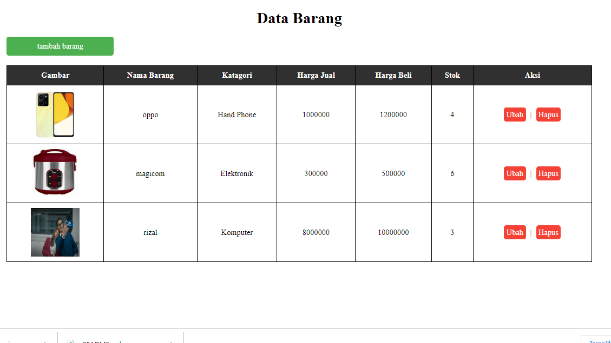

# PROJECT PRAKTIKUM 2 (PHP Dasar)

**_Nama: Mafttuhin Amanulloh_**  
**_Nim : 312110610_**  
**_Kelas : TI.21.A3_**  

 

## **Latihan 2**

### _Data Barang :_

### _Penjelasan :_

- pada from pengambilan data menggunakan method `post`
- pada saat button sumbit di klick maka semua data yang berada di dalam form akan dikirim kepada page ini sendiri dengan http method `post`
- lalu pada script php di menangkap `event` submit dari button yang bernama kirim
- mendeklarasikan variable nama, tanggal lahir dan pekerjaan. dengan mengambil value dari isi method `post` yang sudah di submit
- mendeklarasikan variable tanggal_sekarang dengan mengambil object data dengan format `Y-m-d`
- membuat fungsi perhitungan usia yang memiliki parameter `tanggal_lahir` dan `tanggal_sekarang` dengan memanfaatkan method bawaan dari php yaitu `diff` untuk menghitung selisih waktu dari tanggal sekarang dan tanggal lahir
- membuat pengkondisiian pekerjaan untuk mengetahui gaji dengan menggunakan `switch case`
- menampilkan `Hasil Inputan` dengan tag `table`

